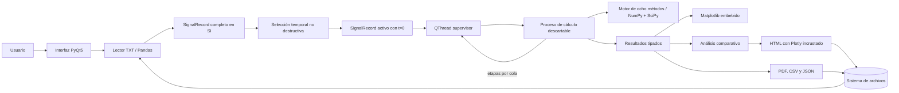
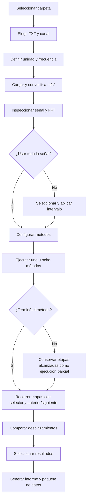

# Arquitectura y flujo

## Decisión arquitectónica

DESP Studio es una aplicación de escritorio local. No utiliza Docker,
PostgreSQL, SQLite, API local, servidor web ni conexión obligatoria. La interfaz
vive en el proceso principal y cada método se calcula en un proceso hijo
descartable. Esta separación conserva los datos bajo control del usuario y evita
que un bloqueo nativo de NumPy, SciPy o BLAS congele toda la aplicación.

El mismo diagrama se conserva como fuente Mermaid en `architecture.mmd`.

## Capas

| Capa | Archivos | Responsabilidad |
| --- | --- | --- |
| Entrada | `core/io.py` | Detectar TXT, canales, tiempo, muestreo y unidades |
| Modelo | `core/models.py` | Contratos `SignalRecord`, `ProcessStep`, `MethodResult` y `PartialMethodResult` |
| Señal | `core/signal_ops.py` | Integración, filtros, tendencias, derivadas y FFT |
| Catálogo | `core/catalog.py` | Parámetros, referencias, límites y flujos de cada método |
| Cálculo | `core/engine.py` | Siete algoritmos de tesis y un flujo específico para puentes/trenes |
| Comparación | `core/analysis.py` | Consenso mediano, correlación, NRMSE y envolventes |
| Informes | `core/reporting.py` | HTML offline, PDF, CSV y JSON |
| Ejecución | `core/execution.py` | Proceso aislado, cola de etapas, cancelación y tiempo límite |
| Interfaz | `gui/` | Flujo Qt, supervisión, controles y gráficas |

## Flujo de usuario

No se evalúa sincronía entre archivos. La unidad de análisis es un canal de un
archivo seleccionado, tal como se pidió para esta etapa del producto.

El recorte es no destructivo: `full_record` conserva la señal cargada y `record`
representa la señal activa. `crop_signal()` toma muestras reales dentro del
intervalo, guarda `crop_start_s` y `crop_end_s` respecto al archivo original y
rebasa el tiempo del segmento para comenzar en cero. Cambiar el segmento invalida
resultados anteriores para impedir comparaciones entre ventanas incompatibles.

## Ejecución y concurrencia

Los trabajos se coordinan secuencialmente desde un `QThread`, pero el cálculo
numérico no se ejecuta en ese hilo: `core/execution.py` crea mediante `spawn` un
proceso hijo por método. La cola multiproceso transmite cada etapa completada y
el resultado final; el `QThread` sólo supervisa la cola y emite señales Qt.
NumPy y SciPy realizan la parte vectorizada; no hay procesamiento GPU porque
estos algoritmos unidimensionales no lo requieren para tamaños habituales.

El lanzador limita OpenBLAS, OpenMP, MKL y NumExpr a un hilo por proceso. En estas
señales 1D evita crear decenas de hilos sin beneficio y reduce el riesgo de
contención entre Qt y las bibliotecas numéricas. Cada método admite cancelación
y un límite de 15 minutos. Si el proceso hijo no responde, el supervisor lo
termina sin comprometer el proceso gráfico.

El ejecutor registra cada `ProcessStep` a medida que se completa. Ante una
condición que realmente impide continuar, devuelve un `PartialMethodResult` y
la interfaz conserva esas gráficas con el motivo de detención visible. Los
parciales no se habilitan para comparación o informe porque no contienen una
estimación final. Los incumplimientos recuperables, como que todas las ventanas
de Bunce superen el umbral de levantamiento, continúan como resultados completos
con una advertencia de calidad persistente.

El botón **Cancelar cálculo** aparece únicamente durante la ejecución. Cerrar la
ventana mientras hay un método activo solicita primero su cancelación y espera
el cierre del proceso hijo, evitando dejar procesos huérfanos.

## Offline y recursos

- Noto Sans está incluida localmente en `assets/fonts` con su licencia.
- Matplotlib se dibuja dentro de Qt.
- Todas las gráficas Qt exponen la barra nativa de Matplotlib: inicio, atrás,
  adelante, paneo, zoom, configuración de subgráficas y exportación.
- Plotly se incrusta completo dentro de cada HTML; el informe no referencia un
  CDN.
- La tesis permanece local y se puede abrir desde la ficha del método.
- Los enlaces a publicaciones son opcionales y no intervienen en el cálculo.

## Identidad visual

La interfaz aplica una retícula horizontal, tipografía Noto Sans, fondos claros,
azul profundo para jerarquía y acentos cian, verde, magenta y ámbar para separar
funciones.
