# Métodos implementados

La fuente de alcance es la tesis local, especialmente los apéndices B a H. Los
scripts MATLAB están impresos dentro del PDF; no existían archivos `.m`
independientes en la carpeta recibida. La implementación traduce los flujos a
Python y convierte en controles las decisiones que los scripts solicitaban por
consola.

El catálogo añade Bunce (2023), la propuesta de superposición modal de Jorge
Luis Martínez Valencia (JM, 2024) y Tokunaga et al. (TK, 2022). Para JM, la
referencia es el correo PDF local y la implementación original en
`easy_ama_jmpc`; estos tres métodos no forman parte de la tesis.

```mermaid
flowchart TB
    TL[TL: PB + PA en a, v y d]
    CH[CH: tendencia + PA + corrección de deriva]
    CB[CB: línea base + pads + PB/PA]
    BO[BO: media preevento + ajuste restringido]
    WA[WA: corrección continua y escalón]
    DA[DA: ajuste lineal/cuadrático/bilineal]
    PA[PA: medias de aceleración y velocidad]
    BU[BU: ventanas + detrend + QC de puente/tren]
    JM[JM: PSD + picos + transferencias modales + IFFT]
    TK[TK: tren + modelo de viga + ajuste de escala + sustitución espectral]
```

El detalle equivalente se conserva en `methods_overview.mmd`.

## Matriz de implementación

| Código | Método | Implementación y controles | Uso principal | Aspecto crítico |
| --- | --- | --- | --- | --- |
| TL | Trifunac y Lee, 1990 | PB y PA Butterworth sin desfase; integración Simpson/trapecios; orden y cortes configurables | Residual esperado cercano a cero | El PA elimina desplazamiento permanente |
| CH | Chiu, 1997 | Tendencia polinómica en aceleración, PA, PB opcional y corrección en velocidad o desplazamiento | Movimiento fuerte digital | Sensible al corte PA y a la variante final |
| CB | Converse y Brady, 1992 | Línea base por recta/media/constante, pads persistentes, PB/PA bidireccional y doble integración con pads | Flujo BAP con banda conocida | No incluye corrección de respuesta instrumental |
| BO | Boore et al., 2002 | Media preevento, ajuste restringido en velocidad, derivada y PA opcional con fase configurable | Desplazamiento residual | Requiere tiempo de primer arribo defendible |
| WA | Wang et al., 2011 | Arribo por umbral configurable, ventana energética, ajuste postevento y búsqueda `t1/t2/t3` | Desplazamiento cosísmico permanente | Mayor costo y sensibilidad a ventanas |
| DA | Darragh et al., 2004 | Ajuste lineal, cuadrático o bilineal continuo en velocidad; selección manual o por MSE | Flujo PEER cercano a falla | La forma funcional exige criterio |
| PA | Park et al., 2005 | Sustracción de medias en aceleración y velocidad | Vibración de puentes y residual cero | No distingue error instrumental de señal física |
| BU | Bunce et al., 2023 | Búsqueda de ventanas, tendencia lineal, doble integración, rechazo de levantamiento y calidad por hombros/picos | Paso de vehículos y trenes sobre puentes | Exige señal de reposo antes/después y acelerómetro de muy bajo ruido |
| JM | Jorge Luis Martínez Valencia, 2024 | PSD Welch, selección de picos por altura, amortiguamiento común, superposición de transferencias modales y transformada inversa | Exploración de respuesta dinámica con el procedimiento de `easy_ama_jmpc` | Sensible al amortiguamiento y a los picos elegidos; requiere contraste independiente |
| TK | Tokunaga, Ikeda y Yoshida, 2022 | Fuerza modal por geometría del tren, ajuste de P0/kb y sustitución de la banda baja por solución teórica; banda superior integrada desde la medición | Paso de tren por un vano simplemente apoyado; desplazamiento en la posición declarada del sensor | Entrada y frecuencia iniciales estimadas, sustituibles por datos identificados; no incluye la cancelación de ruido de 2024 |

## Correspondencia y límites

1. **Escalado:** los scripts MATLAB contienen factores en voltios específicos de
   cada ensayo. DESP Studio recibe aceleración física y hace una conversión de
   unidad explícita. No replica factores de sensores que no aplican a los TXT
   actuales.
2. **Recorte:** los scripts piden manualmente inicio y final antes del método.
   DESP Studio permite escribir esos límites o seleccionarlos sobre la gráfica;
   el segmento se rebasa a `t=0` sin modificar el TXT.
3. **Integración:** se usa `scipy.integrate.cumulative_simpson` o trapecios. Es una
   implementación numérica moderna del propósito descrito, no una reproducción
   bit a bit de la interpolación a 400 Hz usada en algunos ejemplos de la tesis.
4. **Filtros:** se utilizan secciones de segundo orden de SciPy. El preajuste
   reproduce `filtfilt` en TL, CH, CB, BO y DA porque así están escritos los
   scripts MATLAB. En BO y DA la interfaz permite elegir la variante causal
   descrita por el texto metodológico.
5. **Instrumento:** no se implementa deconvolución de respuesta instrumental. Es
   correcta la omisión sólo cuando la entrada ya está calibrada como aceleración.
6. **Wang:** el valor por defecto reproduce el umbral del script de la tesis:
   `1.03 × media(|a|)` en el preevento. También puede utilizarse desviación
   estándar para contrastar el criterio publicado. La búsqueda usa por defecto
   100 divisiones temporales, equivalentes al incremento `te/100` del script;
   el criterio, el nivel de ruido, el valor elegido y el error quedan registrados.
7. **Parámetros iniciales:** TL parte de filtros de orden 1; CH usa pasa baja de
   orden 2 a 30 Hz; y DA usa orden 2 a 25 Hz. Son los valores de partida de los
   ejemplos MATLAB de la tesis, no parámetros universales para cualquier señal.
8. **Diseño automático:** CH y CB ejecutan `scipy.signal.buttord` con `Wp`,
   `Ws`, `Rp` y `Rs`, en lugar de reemplazarlo por un orden supuesto. La interfaz
   conserva además un modo manual separado para estudios de sensibilidad.
9. **Pads de CB:** los ceros añadidos se conservan durante pasa baja, pasa alta y
   doble integración, de acuerdo con el Apéndice D y con Boore (2005). La serie
   final expuesta se recorta nuevamente al intervalo original, mientras las
   etapas permiten inspeccionar la señal extendida.
10. **Chiu:** la opción 2 muestra de manera explícita el Paso 6, integración de la
    velocidad corregida. El cálculo ya existía, pero antes quedaba absorbido por
    la gráfica titulada “Desplazamiento final”.
11. **Bunce:** no filtra la aceleración. Prueba ventanas con diferentes inicios y
    finales, ajusta una recta por ventana y clasifica el resultado según la
    estabilidad de velocidad antes y después de la carga. El modo ferroviario
    inicia con seis ejes separados por `17.4, 17.75, 17.75, 17.75, 17.4 m` y
    usa la velocidad introducida para calcular los tiempos de los puntos medios
    entre ellos al pasar por el sensor. Luz, velocidad y posición del sensor
    son datos manuales. Conserva la duración observada como alternativa y los
    modos de puntos medios o tiempos manuales.
12. **JM:** reproduce la última gráfica de `easy_ama_jmpc`, incluidos sus valores
    iniciales de 20 picos y amortiguamiento `0.002` (0.2 %). El correo propone
    `0.035` (3.5 %) como supuesto general; se conserva la diferencia explícita.
    Welch y el umbral de picos son configurables. El desplazamiento procede de
    la superposición en frecuencia; la velocidad es un diagnóstico derivado
    del desplazamiento para el contrato común de comparación y exportación.
    No se resta la media de la aceleración de entrada ni se fuerza un residual
    nulo. La guía [JM 2024](13_metodo_jorge_martinez_2024.md) detalla cada etapa.
13. **TK:** usa las ecuaciones de 2022 y los límites de frecuencia de esa
    versión. La fuente inglesa de 2023 cambia el límite inferior de ajuste; no
    se mezclan esos valores. Comparte las separaciones iniciales de seis ejes
    con BU y conserva la alternativa de vehículos regulares. Requiere luz,
    velocidad y posición del sensor. La entrada inicial se estima por energía y
    la frecuencia con `50 Lb^(-0.8) Hz`, relación de los casos numéricos del
    artículo; ambas admiten valores manuales. La retirada opcional de media,
    la exclusión de ceros espectrales, el relleno, la detección de entrada y los
    diagnósticos de coherencia son
    decisiones de DESP. La [guía de TK](14_metodo_tokunaga.md) documenta el
    modelo, las bandas y el significado de la escala estimada.

Para los métodos derivados de la tesis, el estado correcto es **implementación
funcional del flujo**, todavía no **equivalencia certificada con MATLAB**. BU,
JM y TK se contrastan con sus propias fuentes, no con los apéndices MATLAB.

La auditoría detallada, sus hallazgos y los métodos candidatos posteriores a la
tesis están en `07_auditoria_y_estado_del_arte.md`.

## Referencias primarias

- H.-C. Chiu, *Stable Baseline Correction of Digital Strong-Motion Data*, BSSA
  87(4), 1997: <https://doi.org/10.1785/BSSA0870040932>
- A. Converse y A. G. Brady, *BAP Basic Strong-Motion Accelerogram Processing
  Software*, USGS OFR 92-296-A: <https://doi.org/10.3133/ofr92296A>
- D. M. Boore, C. D. Stephens y W. B. Joyner, BSSA 92(4), 2002:
  <https://doi.org/10.1785/0120000926>
- R. Wang et al., BSSA 101(5), 2011:
  <https://doi.org/10.1785/0120110039>
- K.-T. Park et al., *Engineering Structures* 27, 2005:
  <https://doi.org/10.1016/j.engstruct.2004.10.013>
- A. Bunce et al., *Mechanical Systems and Signal Processing* 200, 2023:
  <https://doi.org/10.1016/j.ymssp.2023.110554>
- Jorge Luis Martínez Valencia, propuesta de cálculo de desplazamiento por
  superposición modal, noviembre de 2024 según el nombre del archivo,
  [correo electrónico conservado en PDF](../../desp_desktop_app/references/metodoJorgeMartinezNoviembre2024.pdf),
  pp. 1-2; implementación de referencia en
  [`easy_ama_jmpc/callbacks/app_callbacks.py`](../../easy_ama_jmpc/callbacks/app_callbacks.py).
- M. Tokunaga, M. Ikeda y K. Yoshida, *Displacement response waveform
  restoration of simply support bridge during train passage based on
  measurement acceleration integration*, JSCE A1 78(1), 47–60, 2022:
  <https://doi.org/10.2208/jscejseee.78.1_47>;
  [PDF local](../../desp_desktop_app/references/tokunaga_bridge_displacement_2022.pdf).
- M. Tokunaga y M. Ikeda, *Structural Performance Evaluation of Existing
  Bridges Based on Acceleration Monitoring*, QR of RTRI 64(2), 115–120, 2023:
  <https://doi.org/10.2219/rtriqr.64.2_115>
- Tesis local y copia institucional:
  <https://ri.uaemex.mx/handle/20.500.11799/57875>
