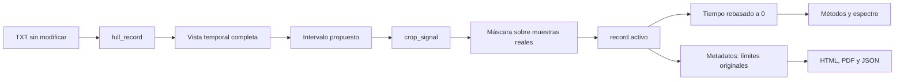
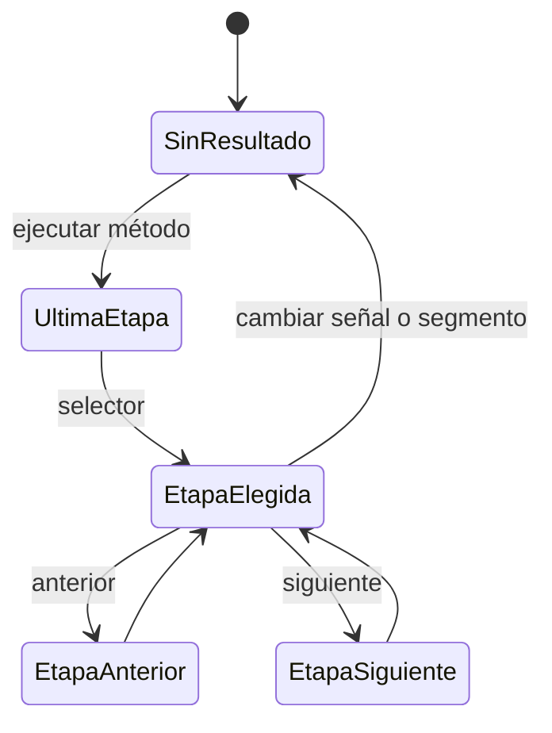

# Interacción con gráficas, recorte y etapas

## Controles de las gráficas

Todas las visualizaciones embebidas usan `PlotPanel`, basado en
`FigureCanvasQTAgg` y `NavigationToolbar2QT`. La misma barra está disponible en
Datos, etapas de métodos y Comparar.

| Control | Función |
| --- | --- |
| Inicio | Recupera el encuadre completo |
| Atrás / adelante | Recorre el historial de encuadres |
| Paneo | Desplaza los ejes mediante arrastre |
| Zoom | Amplía una región rectangular |
| Configuración | Ajusta márgenes y subgráficas |
| Guardar | Exporta la figura con Matplotlib |
| Reproducir / reiniciar | Anima historias temporales cuando aplica |

Al activar cualquier herramienta de navegación se detiene la animación. Así, un
redibujado periódico no reemplaza el encuadre que el usuario está inspeccionando.
Al activar **Seleccionar en gráfica**, cualquier modo de paneo o zoom pendiente
se desactiva antes de capturar el arrastre.

Los informes rasterizados utilizan `FigureCanvasAgg` de forma local. No cambian
el backend global de la aplicación, que permanece en `FigureCanvasQTAgg`. Esto
evita que la generación de informes deshabilite o vuelva inconsistentes los
controles interactivos.

Las vistas dibujan hasta 20 000 puntos para conservar respuesta interactiva en
registros largos. Es un nivel de detalle exclusivamente visual; el recorte, los
cálculos y los archivos exportados trabajan con los arreglos completos.

## Recorte no destructivo

La etapa Datos ofrece dos formas equivalentes de definir el intervalo:

1. Introducir Inicio y Final en segundos.
2. Activar **Seleccionar en gráfica** y arrastrar con el botón izquierdo.

El intervalo queda propuesto y resaltado hasta pulsar **Aplicar segmento**. El
botón de restauración recupera la señal completa. Aplicar o restaurar elimina los
resultados calculados previamente, porque pertenecen a otra señal de entrada.

### Invariantes

- El archivo fuente y `full_record` nunca se modifican.
- El intervalo debe contener al menos cuatro muestras.
- Inicio y Final se ajustan a muestras existentes.
- La frecuencia de muestreo, canal y unidad permanecen sin cambios.
- Los métodos reciben exclusivamente el segmento activo con tiempo desde cero.
- Los parámetros temporales de cada método se interpretan desde el inicio del
  segmento activo, no desde el inicio del TXT original.
- HTML, PDF y `results.json` conservan la procedencia temporal del segmento.

## Navegación de etapas

Los resultados ya no crean una pestaña horizontal por cada paso. Cada método
presenta una sola etapa a la vez dentro de un `QStackedWidget`, gobernado por un
selector desplegable, contador y botones anterior/siguiente.

Las etapas se reciben desde el proceso de cálculo a medida que terminan y quedan
disponibles inmediatamente. Durante ese intervalo la vista muestra
**Procesamiento en curso** y el estado informa tiempo y número de etapas. Las
figuras permanecen en la pila; cambiar de etapa no recalcula el método y cada
gráfica conserva controles de zoom, paneo e historial propios.

El botón **Cancelar cálculo** conserva lo ya recibido como ejecución parcial. Un
resultado parcial se puede inspeccionar, pero no participa en comparación ni en
informes porque aún no contiene un desplazamiento final válido.
