# Método para puentes y selección de candidatos

Fecha de decisión: 3 de septiembre de 2026.

## Decisión

Se incorporó como octavo método el procedimiento de Bunce et al. (2023). Es el
candidato con mayor correspondencia con el objetivo real de DESP Studio porque
fue ensayado en puentes carreteros y ferroviarios, incluyendo trenes en servicio.
PRISM, TOA, optimización convexa, HSA/EMD y VMD se mantienen documentados, pero
no se presentan como resultados ejecutables equivalentes mientras falten sus
insumos o una reproducción verificable de la formulación completa.

```mermaid
flowchart LR
    S[Segmento con reposo inicial] --> L[Entrada y salida del tren]
    L --> W[Combinar inicios y finales]
    W --> D[Ajuste lineal por ventana]
    D --> I[Integrar a velocidad y desplazamiento]
    I --> Q1{¿Levantamiento admisible?}
    Q1 -- No --> X[Marcar fuera del límite]
    Q1 -- Sí --> Q2[Medir planitud de hombros]
    X --> Q2
    Q2 --> M{¿Control ferroviario?}
    M -- No --> A{¿hay ventanas aceptadas?}
    M -- Sí --> G[Geometría o tiempos manuales]
    G --> Q3[Detectar y asociar recuperaciones P_i]
    Q3 --> A
    A -- Sí --> R[Ordenar ventanas aceptadas]
    A -- No --> E[Advertir y ordenar todas como exploratorias]
    E --> R
```



El flujo está disponible además en `bunce_bridge.mmd` y el diagrama comparativo
en `candidate_methods.mmd`.

La explicación gráfica, las ecuaciones del indicador y la correspondencia de
cada vista con la publicación están en `11_guia_visual_bu_2023.md`.

## Insumos del método Bunce

Con un único TXT se puede ejecutar el control básico si el registro incluye:

- aceleración vertical calibrada y frecuencia de muestreo correcta;
- un tramo descargado antes de que el tren entre;
- el paso completo del tren;
- un tramo descargado después de que el tren salga.

La aplicación propone inicialmente entrada y salida mediante una detección
auxiliar por energía; registra expresamente que esa detección no forma parte del
método publicado. El analista debe inspeccionarla y puede sustituirla por límites
manuales. Si la detección no es concluyente, el método no ejecuta con tiempos
inventados.

El preajuste usa el **control básico por hombros**. El control ferroviario se
activa expresamente y exige al menos dos recuperaciones `P_i` esperadas. Estas se pueden
introducir como tiempos desde la entrada o calcular con la geometría que indica
la publicación:

```text
L   = B + longitud entre el primer y el último eje
d_i = m_i + x_sensor
P_i = (d_i / L) T                 usando la duración observada
P_i = d_i / v                     usando una velocidad conocida
```

`B` es la luz del vano, `x_sensor` se mide desde el apoyo por el que entra el
tren y `m_i` se mide desde el primer eje hasta el centro del hueco entre dos
conjuntos de ejes consecutivos. Para un sensor en centro de vano,
`x_sensor=B/2`, como en el artículo. No debe usarse la longitud entre topes si
difiere de la distancia entre ejes extremos.

La aplicación no decide por sí sola qué ejes forman un conjunto o bogie: esa
agrupación tiene significado mecánico y la define el analista. A partir de la
geometría introducida calcula `P_i`, la velocidad efectiva, la distancia total
de cruce y la diferencia entre la duración observada y la estimada. Todos esos
valores quedan en los diagnósticos y en el informe.

### Picos y valles en la terminología de BU

BU llama **valles `T_i`** a las excursiones de flecha producidas por los
conjuntos de ejes y **picos `P_i`** a las recuperaciones que existen entre dos
valles consecutivos. Por tanto, el patrón ideal de seis cargas es:

```text
T1 -- P1 -- T2 -- P2 -- T3 -- P3 -- T4 -- P4 -- T5 -- P5 -- T6
```

Ver seis máximos de flecha hacia abajo junto con cinco recuperaciones no es un
descuadre: es la forma esquemática exacta de la Figura 10 del artículo. Esta
relación sólo es aplicable si los huecos entre conjuntos descargan el vano lo
suficiente. Si la luz es mucho mayor que dichos huecos, varios conjuntos pueden
cargar el puente simultáneamente y la hipótesis ferroviaria pierde validez.

## Controles y salidas

| Control | Interpretación |
| --- | --- |
| Entrada/salida | Límites de la respuesta forzada |
| Zona por extremo | Intervalo de posibles inicios y finales descargados |
| Paso entre ventanas | Resolución de la búsqueda; un periodo de muestra reproduce la búsqueda exhaustiva |
| Máximo de ventanas | Límite operativo de costo; la malla se adelgaza uniformemente si se supera |
| Dirección y levantamiento | Rechazo físico según la convención del acelerómetro; la opción automática registra la excursión dominante |
| Control de calidad | `Hombros` funciona sólo con la señal; `Tren` exige dos o más recuperaciones `P_i` |
| Luz y posición del sensor | Geometría del vano en la dirección de circulación |
| Longitud entre ejes extremos | Recorrido del tren que interviene en `L` |
| Puntos medios `m_i` | Centros de los huecos que originan recuperaciones; lista creciente desde el primer eje |
| Base temporal | Duración observada `T` o velocidad aproximada `v` |
| Recuperaciones manuales | Alternativa auditable cuando los tiempos `P_i` ya fueron calculados externamente |
| Separación mínima | Equivalente a `MinPeakDistance`; 1.5 s en el ensayo publicado |
| Anchura mínima | Equivalente a `MinPeakWidth`; 1.5 s en el ensayo publicado |
| Prominencia mínima | Equivalente a `MinPeakProminence`; 1 mm en el ensayo publicado |
| Tolerancia de asociación | Distancia máxima para emparejar una detección real con un `P_i` previsto |

### Ejemplo de captura

Para `B=20 m`, sensor a `10 m`, tren entre ejes extremos de `40 m`, duración
observada `T=4 s` y puntos medios `m_i=5, 15, 25 m`, la aplicación obtiene
`L=60 m`, una velocidad efectiva de `15 m/s` (`54 km/h`) y picos a `1.000`,
`1.667` y `2.333 s` después de la entrada.

La velocidad es una base temporal alternativa, no un dato adicional que se
promedie con `T`. Si se elige velocidad, la interfaz calcula también la duración
de paso prevista y conserva la diferencia respecto a la observada para detectar
errores de dirección, longitud o límites del evento.

El umbral de `5 mm` es el valor práctico usado por Bunce et al. para descartar
levantamientos inverosímiles, no una constante universal del puente. Si existen
ventanas que cumplen, las demás se excluyen como en la publicación. Si todas lo
exceden, la aplicación informa el menor levantamiento aparente para ambas
convenciones, continúa la clasificación y presenta el resultado como
**exploratorio no validado**. La advertencia permanece sobre las gráficas y en
el informe. Cambiar la polaridad o ampliar el umbral sólo es válido tras
comprobar el montaje, la geometría y la respuesta física esperada.

El informe guarda la ventana ganadora, cantidad evaluada y aceptada, pendientes
de los hombros, indicador de calidad y tendencia lineal sustraída. Un indicador
bajo sirve para clasificar candidatos, pero no es por sí solo una incertidumbre
metrológica. En modo tren también guarda los números de recuperaciones esperadas,
detectadas, asociadas, faltantes y adicionales, además de los valles observados.

## Evaluación de los otros candidatos

| Candidato | ¿Funciona sólo con el TXT actual? | Pertinencia para paso de tren | Decisión |
| --- | --- | --- | --- |
| PRISM/ABC | Parcialmente; faltan metadatos sísmicos, onset y selección de banda | Baja-media; sus QA son útiles, pero el flujo es sísmico | Mantener como referencia QA |
| TOA | En principio sí | Media; puede reducir deriva oscilatoria | No implementar sin artículo/suplemento completo y benchmark |
| Convexa residual | No de forma independiente; necesita residual objetivo | Media si existe LVDT/GNSS/cámara; débil si se impone cero sin evidencia | Reservar para futura fusión sensorial |
| HSA/EMD | Sí, con dependencia especializada | Baja para respuesta transitoria; concebido para señal cercana a falla | Experimental, no añadir al banco productivo |
| VMD | Sí, con dependencia y selección modal | Baja para tránsito; preserva desplazamiento cosísmico permanente | Experimental, referencia local 2023 |

La hipótesis de desplazamiento residual cero suele ser razonable después de un
paso ferroviario si la estructura permanece elástica, pero debe comprobarse con
el contexto estructural. Si existe daño, asiento, movimiento de apoyo o respuesta
cuasiestática prolongada, imponer cero puede borrar movimiento físico.

## Referencias

- A. Bunce et al., *A robust approach to calculating bridge displacements from
  unfiltered accelerations for highway and railway bridges*, 2023,
  <https://doi.org/10.1016/j.ymssp.2023.110554>.
- J. Jones, E. Kalkan y C. Stephens, *PRISM methodology and automated
  processing*, USGS, 2017, <https://doi.org/10.3133/ofr20171008>.
- C. J. Wong y L. F. Ibarra, TOA, 2023,
  <https://doi.org/10.1016/j.soildyn.2023.108162>.
- Z. He et al., optimización convexa y residual objetivo, 2023,
  <https://doi.org/10.1016/j.soildyn.2022.107676>.
- X. Xu et al., VMD, 2023, <https://doi.org/10.21595/vp.2023.23663>.

## Validación pendiente

La prueba sintética automatizada comprueba que el método recupera una flecha
transitoria conocida aun con sesgo lineal. Falta validarlo con aceleración y
desplazamiento óptico/LVDT del mismo paso de tren. El propio artículo indica que
sus datos pueden solicitarse a los autores; no se publicaron como descarga junto
con el PDF.
