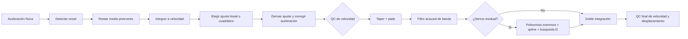
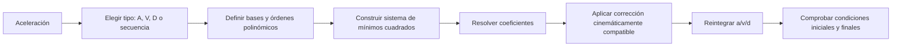
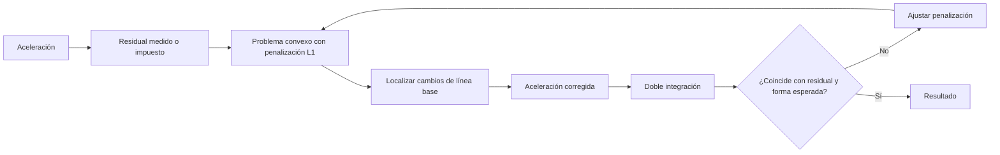
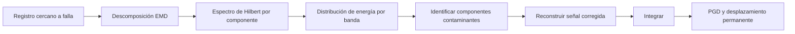
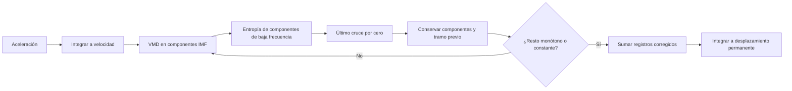

# Fichas de métodos candidatos

Estas fichas describen qué haría falta para convertir cada referencia en una
implementación ejecutable. Los diagramas son reconstrucciones originales a
partir de las publicaciones citadas; no son figuras copiadas de los artículos.

## PRISM y corrección adaptativa

**Insumos:** aceleración calibrada, preevento, onset, frecuencia de muestreo,
esquinas de filtro defendibles y umbrales de calidad. El flujo oficial también
usa metadatos sísmicos para seleccionar banda y generar productos COSMOS.

**Decisión:** no añadirlo como método de tren. Sus ideas de trazabilidad, pads y
QC sí son aplicables. Referencia local:
[`prism_methodology_usgs_2017.pdf`](../../desp_desktop_app/references/prism_methodology_usgs_2017.pdf).

## TOA

**Insumos:** el TXT actual es suficiente en principio. Faltan, para una réplica
defendible, el texto completo o material suplementario que define las matrices,
bases, normalización y aplicación consistente de las siete combinaciones.

**Decisión:** no etiquetar una detracción polinómica genérica como TOA. Chiu,
Darragh y Park ya permiten estudiar varias de sus ideas sin afirmar equivalencia.
Referencia: <https://doi.org/10.1016/j.soildyn.2023.108162>.

## Optimización convexa con residual objetivo

**Insumo adicional obligatorio:** desplazamiento residual objetivo obtenido con
GNSS, LVDT, cámara, radar u otra referencia. En un paso de tren puede proponerse
cero sólo si se ha comprobado respuesta elástica y retorno al reposo.

**Decisión:** reservarlo para una futura modalidad de fusión o validación. El
resumen publicado no basta para reproducir todos los detalles del solver y la
selección iterativa de la penalización. Referencia:
<https://doi.org/10.1016/j.soildyn.2022.107676>.

## HSA con EMD

**Insumos:** puede operar con aceleración, pero necesita una implementación EMD
especializada, reglas completas de selección y casos cercanos a falla para
validación. Su objetivo es preservar desplazamiento permanente sísmico, distinto
de la flecha transitoria de un puente descargado.

**Decisión:** no incorporar al flujo operativo ferroviario. Referencia:
<https://doi.org/10.1016/j.soildyn.2022.107162>.

## VMD iterativo

**Insumos:** el TXT es suficiente, pero se necesita una biblioteca VMD incluida
en la distribución y fijar criterios de convergencia, número de modos, penalidad
y entropía. El artículo de 2023 remite parte del procedimiento detallado a una
referencia de congreso de 2021 y señala que los datos se solicitan a los autores.

**Decisión:** conservar como experimento sísmico, no como estimador principal de
paso de tren. Referencia local CC BY:
[`vmd_baseline_2023.pdf`](../../desp_desktop_app/references/vmd_baseline_2023.pdf).
La variante VMD de tres segmentos de 2026 permanece sólo referenciada mediante
su DOI: <https://doi.org/10.1016/j.soildyn.2026.110089>.

## Regla para promover un candidato

Hasta completar esa cadena, un candidato puede estudiarse pero no debe mezclarse
con resultados operativos en informes sin una etiqueta experimental explícita.
