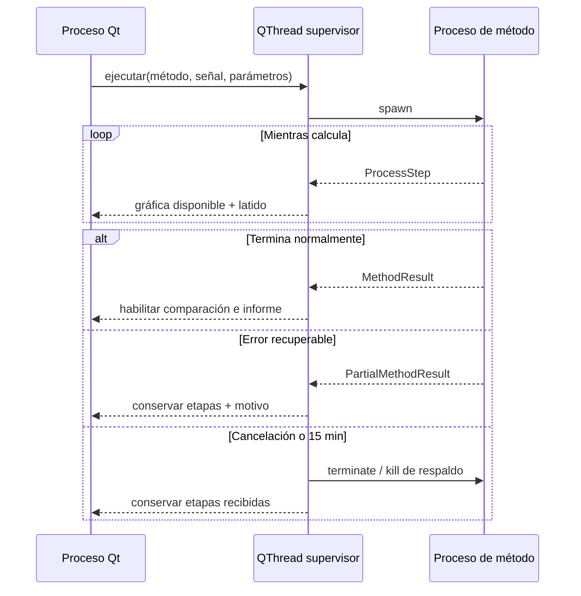

# Aislamiento, cancelación y recuperación

## Incidente diagnosticado

Durante una ejecución de Bunce la ventana dejó de responder y el sistema mostró
el diálogo **Wait / Force Quit**. El resto del escritorio continuó funcionando.
La inspección del proceso mostró estas condiciones:

- el proceso gráfico seguía vivo, pero consumía 0 % de CPU;
- el hilo principal de Qt y el hilo de análisis estaban dormidos en esperas
  `futex`;
- el proceso había creado decenas de hilos de la biblioteca BLAS;
- no había un diálogo modal oculto ni trabajo numérico progresando;
- el mismo TXT, canal y configuración visible de Bunce terminaron en menos de un
  segundo al reproducirse en un proceso limpio.

La evidencia descarta una carga legítimamente lenta y señala un interbloqueo
nativo excepcional entre el ciclo de vida del hilo y las bibliotecas numéricas.
No fue posible extraer la pila nativa exacta porque el sistema impidió adjuntar
`gdb` al proceso, por lo que esta atribución es una inferencia técnica, no la
identificación de una llamada nativa única.

## Arquitectura de recuperación

`core/execution.py` usa el modo `spawn`, también compatible con Windows y con
futuros ejecutables PyInstaller mediante `multiprocessing.freeze_support()`.
El proceso hijo no persiste datos ni queda residente: se crea para un método y
se recoge siempre en el bloque de limpieza.

## Operación ante una ventana bloqueada

1. Si el estado de la aplicación sigue actualizando segundos o etapas, usar
   **Cancelar cálculo** y esperar el cierre controlado.
2. Si el sistema muestra repetidamente **Wait / Force Quit**, la ventana no
   actualiza su estado y el consumo permanece sin actividad, usar
   **Force Quit**.
3. Relanzar con `./launch_desp_desktop_app.sh` y repetir el método. Desde esta
   revisión, un bloqueo del cálculo queda contenido en el proceso hijo.

Los TXT se abren sólo para lectura y no se alteran al forzar el cierre. La
versión actual no guarda sesiones automáticamente; por tanto, parámetros y
resultados que sólo existan en memoria sí se pierden al cerrar de forma forzada.
Los informes y paquetes ya exportados permanecen intactos.

## Controles preventivos

- BLAS y motores afines limitados a un hilo desde el lanzador.
- Latido de cálculo visible cada segundo.
- Etapas transmitidas y visibles tan pronto como se completan.
- Cancelación explícita desde la pantalla de métodos.
- Tiempo máximo de 15 minutos por método.
- Cierre de ventana diferido hasta recoger el proceso activo.
- Pruebas automáticas de resultado, transmisión de etapas, cancelación, tiempo
  límite e integración Qt.
