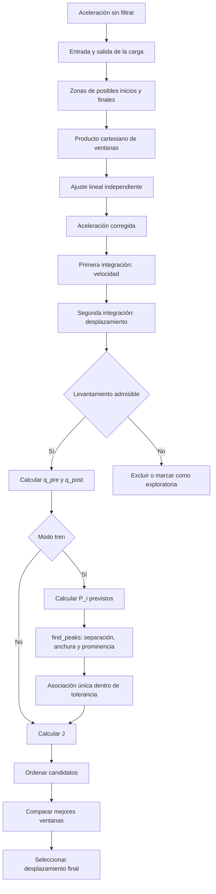

# Guía visual del método BU 2023

`BU` es el código corto utilizado por DESP Studio para el método de Bunce et al.
(2023); no es un acrónimo definido por los autores. La referencia primaria está
incluida localmente en
`desp_desktop_app/references/bunce_bridge_displacement_2023.pdf`.

## Idea central

La doble integración amplifica con rapidez cualquier error de baja frecuencia.
BU no intenta escoger una frecuencia de corte: conserva la aceleración sin
filtrar, ensaya diferentes ventanas alrededor del paso y ajusta una recta propia
a cada ventana. La ventana cuya integración satisface mejor condiciones físicas
de reposo se toma como la estimación más confiable.

Para una ventana con tiempo local `tau`, la aplicación calcula:

```text
a_corr(tau) = a(tau) - (c0 + c1 tau)
v(tau)      = integral(a_corr dt), con v(0) = 0
d(tau)      = integral(v dt),      con d(0) = 0

q_pre      = media(|v|) antes de la entrada
q_post     = media(|v|) después de la salida
q_shoulder = suma(|v_pre|, |v_post|) / (N_pre + N_post)
q_peak     = media(|Delta d_P / Delta t_P|)  [sólo modo tren]
J          = q_shoulder                       [modo hombros]
J          = q_shoulder + q_peak              [modo tren]
```

Un valor bajo de `J` significa hombros más planos y, en modo ferroviario, picos
intermedios más consistentes. Es un indicador de clasificación, no una medida
formal de incertidumbre.

La configuración inicial activa el control de tren con velocidad conocida y
seis ejes separados por `17.4, 17.75, 17.75, 17.75, 17.4 m`. Hay que introducir
la luz, la velocidad y la posición del sensor desde el apoyo de entrada. Los
cinco puntos medios se calculan con esa lista; sirven para prever recuperaciones,
sin imponer que el desplazamiento tenga cinco picos. La
[guía de configuración](08_metodo_bunce_y_seleccion_tecnica.md#insumos-del-método-bunce)
detalla las posiciones y los modos alternativos de geometría manual y hombros.

## Flujo calculado y observado



La fuente independiente del diagrama está en `bunce_visual_pipeline.mmd`.

## Gráficas disponibles

| Vista | Qué responde | Lectura esperada |
| --- | --- | --- |
| Aceleración original sin filtrar | ¿Qué señal entra realmente? | Reposo a ambos lados, sin recorte del paso ni saturación |
| Espectro diagnóstico | ¿Hay energía de muy baja frecuencia? | Advierte sensibilidad; no modifica ni filtra la señal |
| Detección auxiliar del paso | ¿Por qué DESP propuso esos límites? | La envolvente RMS supera el umbral durante el evento |
| Intervalo de respuesta forzada | ¿Dónde está el vehículo sobre el puente? | El evento completo queda entre dos tramos descargados |
| Zonas de inicio y final | ¿Qué límites alternativos se ensayan? | Zona 1 antes, zona 2 durante y zona 3 después del paso |
| Recuperaciones ferroviarias esperadas | ¿Dónde deberían descargarse los conjuntos de ejes? | Los `P_i` son tiempos aproximados de asociación |
| Ventanas evaluadas | ¿Qué pares inicio-final entraron al cálculo? | Cada punto representa una ventana; se destaca la ganadora |
| Indicador de calidad | ¿Por qué una ventana ocupa el primer lugar? | El rango 1 minimiza hombros y, si aplica, gradiente entre recuperaciones |
| Control de levantamiento | ¿Qué soluciones contradicen la física esperada? | Los valores sobre el límite se excluyen o generan advertencia |
| Estabilidad de mejores ventanas | ¿La solución depende de un único par de límites? | Las primeras curvas deberían coincidir durante la carga |
| Tendencia seleccionada | ¿Qué sesgo lineal se sustrae? | Una pendiente sutil puede cambiar mucho el desplazamiento |
| Aceleración sin tendencia | ¿Qué señal se integra? | Centrada cerca de cero en los tramos descargados |
| Velocidad y gradiente de hombros | ¿Cómo se mide la planitud? | `v` próxima a cero antes y después del paso |
| Desplazamiento y hombros | ¿La integración vuelve al reposo? | Hombros planos cerca de 0 mm y flecha físicamente coherente |
| Recuperaciones `P_i` y valles `T_i` | ¿Coinciden geometría y desplazamiento? | Cinco recuperaciones pueden separar seis valles; faltantes y extras generan advertencia |
| Desplazamiento final | ¿Cuál serie se exporta y compara? | Interpretar sólo la ventana; el exterior es relleno de alineación |

Con límites manuales y control por hombros se generan 13 vistas. La detección
automática añade una. El control ferroviario añade las vistas de picos esperados
y picos encontrados; con detección automática puede haber 16 vistas.

## Relación con el artículo

Las siguientes operaciones proceden del método publicado:

- aceleración sin filtrar;
- ventanas con precarga, respuesta forzada y poscarga;
- ajuste lineal independiente por ventana;
- doble integración con condiciones iniciales nulas;
- exclusión por levantamiento aparente;
- calidad por velocidad absoluta media de los hombros;
- uso de geometría de puente y tren para predecir `P_i`;
- detección por separación, anchura y prominencia y calidad por consistencia de las recuperaciones;
- clasificación de ventanas y revisión de soluciones alternativas.

DESP añade el espectro, la detección RMS automática, el límite operativo de
candidatos, la polaridad automática, la asociación única con los `P_i` previstos
y la continuidad exploratoria cuando fallan los controles. Esas decisiones
aparecen identificadas en las explicaciones y diagnósticos. `scipy.find_peaks`
reproduce los tres criterios publicados, aunque no se presume equivalencia bit a
bit con `MATLAB findpeaks` sin los datos originales.

## Revisión recomendada

1. Verificar señal, unidad, frecuencia y ausencia de saturación.
2. Confirmar manualmente entrada y salida del tren.
3. Revisar que las zonas de búsqueda sólo contengan puente descargado.
4. Confirmar polaridad y umbral de levantamiento con el montaje real.
5. En modo tren, comprobar `B`, posición del sensor, velocidad y lista de
   separaciones; revisar la longitud y los puntos medios `m_i` derivados, o los
   campos manuales si se eligió esa alternativa.
6. Examinar el indicador y la estabilidad de las cinco mejores ventanas.
7. Inspeccionar tendencia, velocidad y hombros antes de aceptar la flecha.
8. Contrastar picos ferroviarios y ejecutar sensibilidad de límites.
9. Cuando exista, comparar contra LVDT, GNSS, estación total o visión sincronizada.

Todas las gráficas se conservan dentro del resultado, son interactivas en Qt y
se incluyen en HTML/PDF cuando se activa **Incluir gráficas de todas las etapas**.

## Referencia

A. Bunce et al., *A robust approach to calculating bridge displacements from
unfiltered accelerations for highway and railway bridges*, Mechanical Systems
and Signal Processing 200 (2023) 110554,
<https://doi.org/10.1016/j.ymssp.2023.110554>.
