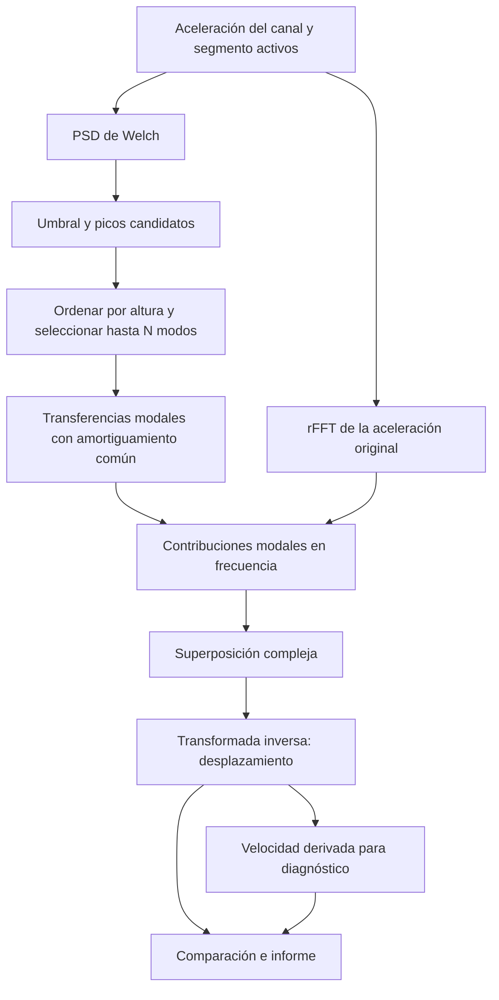

# Superposición modal de Jorge Luis Martínez Valencia, JM 2024

`JM` identifica en DESP Studio la propuesta de Jorge Luis Martínez Valencia para
estimar desplazamientos mediante superposición modal a partir de aceleraciones.
Es el noveno método y su identificador de cálculo es `martinez_2024`.

La referencia conceptual es el
[correo electrónico conservado en PDF](../../desp_desktop_app/references/metodoJorgeMartinezNoviembre2024.pdf).
El procedimiento numérico se recupera de la función
`calculate_displacement_superposition_psd` en
[`easy_ama_jmpc/callbacks/app_callbacks.py`](../../easy_ama_jmpc/callbacks/app_callbacks.py).
Ese callback genera la última gráfica del front original, `graph-13`, titulada
**Desplazamiento Superposición Frecuencias Modales (X, Y, Z)**. DESP Studio
ejecuta el procedimiento sobre el canal y el segmento activos, como los otros
métodos de escritorio.

## Procedencia y fecha

El nombre `metodoJorgeMartinezNoviembre2024.pdf` y la identificación del autor
sitúan la propuesta en noviembre de 2024. La copia de cinco páginas muestra una
fecha de impresión del 8 de septiembre de 2026 y no conserva la cabecera de envío
original. Por ello, no se atribuye al correo un día de envío verificable.

Las páginas 1 y 2 describen Welch, selección de picos, amortiguamiento y suma
modal. Las páginas 2 a 4 presentan resultados de dos pasos de tren. Las imágenes
de las ecuaciones no son legibles en la copia recibida; la expresión exacta
implementada se verifica en el código original.

## Cálculo

Con aceleración `a(t)` en m/s², frecuencia de muestreo `fs` y `N` muestras, se
calcula una PSD de Welch. Sus picos se ordenan por altura decreciente y se toman
hasta `num_modes` frecuencias cuyo pico alcance el umbral relativo configurado.
Estas frecuencias se usan como frecuencias modales candidatas `f_n`.

La transformada real de la aceleración original y cada transferencia se evalúan
sobre la malla completa de Fourier:

```text
A(ω)       = rFFT(a)
ω          = 2π f
ω_n        = 2π f_n
H_n(ω)     = 1 / (ω_n² - ω² + 2j ζ ω_n ω)
U_n(ω)     = H_n(ω) A(ω)
U_total(ω) = suma_n U_n(ω)
d(t)       = irFFT(U_total, n=N)
```

La masa modal está normalizada a uno y todos los términos comparten el mismo
amortiguamiento `ζ`. Como en el legado, se suma `1e-6` a los denominadores cuyo
módulo sea menor que `1e-6` para evitar una división numérica singular.

Cada transferencia multiplica **todo el espectro de la aceleración**. Elegir un
pico decide qué transferencia entra en la suma; no crea una máscara que elimine
las demás frecuencias de la señal. Tampoco se añaden filtros pasa alta/pasa baja,
correcciones de deriva ni sustracciones de media antes de esta transformada.

La PSD usa una ventana Hann, solapamiento del 50 %, centrado constante por
segmento y densidad unilateral. Si la señal tiene menos muestras que el tamaño
Welch solicitado, se utiliza el número de muestras disponible. El centrado que
Welch aplica a cada segmento sólo interviene en la PSD; no cambia la aceleración
utilizada en `rFFT(a)`.

## Parámetros y diferencia con el correo

| Control y clave | Valor inicial | Intervalo | Procedencia y efecto |
| --- | --- | --- | --- |
| Máximo de modos, `num_modes` | 20 | Entero entre 1 y 200 | Valor efectivo de la función original; se toman menos si no hay suficientes picos |
| Amortiguamiento común, `damping_ratio` | 0.002 = 0.2 % | Fracción mayor que 0 y menor o igual que 1 | Valor efectivo usado por `graph-13`, que no pasa argumentos opcionales |
| Muestras Welch, `welch_nperseg` | 512 | Entero entre 4 y 65536 | Código y correo; controla resolución de la PSD y puede cambiar los picos detectados |
| Umbral relativo de picos, `peak_threshold_ratio` | 0.001 = 0.1 % | Fracción entre 0 y 1 | Fracción de la altura máxima de la PSD; no representa una fracción de energía integrada |

El correo menciona 2 % para un caso particular y propone un valor general de
3.5 %, equivalente a `ζ = 0.035`. También describe ensayos con 20, 50, 100 y 200
modos. El código recibido usa `ζ = 0.002` y 20 modos. Se conservan los valores
del código para reproducir la gráfica solicitada; el control de amortiguamiento
permite evaluar el valor del correo. **0.2 % y 2 % no son el mismo ajuste.**

Para reproducir el legado también deben coincidir el canal, la calibración, la
frecuencia de muestreo y el segmento temporal. Cambiar el segmento cambia tanto
la PSD como la malla de Fourier y puede modificar los resultados. El motor
requiere intervalos temporales uniformes y una frecuencia de muestreo coherente
con ellos; se detiene si estas condiciones no se cumplen.

## Gráficas y artefactos intermedios



La fuente Mermaid independiente está en `martinez_modal.mmd`.

| Etapa | Artefacto | Qué permite revisar |
| --- | --- | --- |
| Aceleración de entrada | `raw_acceleration` | Canal, segmento, unidades y sesgo que recibe el método |
| Espectro de entrada | `raw_spectrum` | Contenido frecuencial de la aceleración |
| PSD y umbral | `welch_psd` | Distribución espectral, altura mínima y picos candidatos |
| Selección por altura | `modal_selection` | Frecuencias retenidas y efecto del número máximo de modos |
| Contribución de cada modo | `modal_contribution_001` y siguientes | Desplazamiento temporal de ese término individual |
| Módulo de transferencia | `modal_transfer_amplitude` | Ganancia de la transferencia total |
| Fase de transferencia | `modal_transfer_phase` | Desfase de la transferencia total |
| Espectro de desplazamiento | `modal_displacement_spectrum` | Superposición modal en frecuencia |
| Velocidad auxiliar | `derived_velocity` | Evolución temporal derivada del desplazamiento; no es una primera integración de la aceleración |
| Desplazamiento final | `final_displacement` | Serie completa que se compara y exporta |

Cada modo seleccionado conserva su propia etapa temporal; no se limita la
inspección a los primeros términos de la suma. Con `M` modos seleccionados se
obtienen `M + 9` etapas. La suma de todos los términos se observa en el espectro
de desplazamiento y en la historia temporal final.

Las etapas utilizan el mismo selector, anterior/siguiente, zoom, paneo, colores
y exportación de figuras de la aplicación. Se incluyen en el HTML/PDF cuando se
activa **Incluir gráficas de todas las etapas**. Los parámetros y diagnósticos
viajan con el resultado, y los CSV conservan las muestras completas.

La aceleración del resultado es la entrada que utilizó el algoritmo. La
velocidad es una magnitud auxiliar calculada con
`numpy.gradient(d, time_s, edge_order=2)`, añadida
para la inspección y el formato común de salida; no estaba presente en la
función modal original ni interviene en el cálculo del desplazamiento.

Los diagnósticos registran el número de picos detectados y seleccionados, sus
frecuencias y alturas PSD, el tamaño efectivo de Welch, la frecuencia de
muestreo efectiva, la altura del umbral y las divisiones regularizadas. También
identifican la conservación del DC y el origen auxiliar de la velocidad.

Si no se detecta ningún pico admisible, se conservan las cuatro primeras etapas
y la ejecución termina como parcial con un mensaje explicativo. Así se puede
revisar la PSD y la selección; no se ofrece una serie de ceros como estimación
válida para comparación. Ésta es una protección adicional de DESP respecto al
legado.

## Interpretación y límites

Los picos de Welch son candidatos espectrales. Su selección por altura no
demuestra que cada uno sea un modo estructural ni identifica formas modales,
masas o factores de participación. El amortiguamiento común tampoco garantiza
que se eliminen contribuciones de apoyos u otras fuentes.

El procedimiento reproduce una estimación por transferencias de osciladores. No
es una doble integración cinemática: en frecuencia, la relación ideal entre un
desplazamiento y su propia aceleración es `D(ω) = -A(ω)/ω²` para `ω != 0`, que
no coincide con la transferencia utilizada aquí. La exactitud física necesita
un contraste de desplazamiento independiente.

La afirmación del correo de una oscilación centrada en cero no es una condición
impuesta por el código. Si la aceleración tiene media no nula, el término DC
contribuye porque `H_n(0) = 1/ω_n²`. En el caso habitual sin regularización del
denominador DC:

```text
media(d) = media(a) × suma_n(1/ω_n²)
```

Por tanto, no se fuerza `d(0)=0`, media nula ni residual final nulo. No deben
interpretarse automáticamente estas magnitudes como flecha estática o
desplazamiento permanente recuperado. La reconstrucción por FFT también puede
mostrar efectos de borde cuando el segmento no es aproximadamente periódico.

La comparación numérica con la función original comprueba fidelidad de
implementación. La coincidencia con el legado o la estabilidad visual no
sustituyen la validación con LVDT, GNSS, visión u otra medida sincronizada de
desplazamiento.

## Validación realizada

La verificación del 8 de septiembre de 2026 completó **74 pruebas**, incluidas
14 nuevas de cálculo modal, informes y contratos de interfaz. Se comparó además
el desplazamiento con la función original extraída de `easy_ama_jmpc`, sin
iniciar su aplicación Dash, sobre estos archivos reales:

- [`via1_60km_1_tren_24242005.txt`](../../easy_ama_jmpc/assets/Via01_23320015/Via01_23320015/Events_ASCII/via1_60km_1_tren_24242005.txt):
  21 095 muestras a 500 Hz.
- [`via2_60km_1tren_24242005.txt`](../../easy_ama_jmpc/assets/Events_ASCII/Events_ASCII/via2_60km_1tren_24242005.txt):
  10 841 muestras a 250 Hz.

Se contrastaron X, Y y Z de ambos registros con los valores iniciales y Z de
ambos con `ζ = 0.035`. En las **ocho comparaciones**, DESP Studio y la función
original produjeron vectores de desplazamiento idénticos: error absoluto máximo
de **0**. Los demás parámetros se mantuvieron en 20 modos, 512 muestras Welch y
umbral relativo 0.001.

La equivalencia de código no reproduce las cifras indicadas en el correo. Los
extremos de Z, en milímetros, fueron:

| Registro | Código recibido y DESP, ζ = 0.002: mínimo / máximo | Correo: mínimo / máximo |
| --- | --- | --- |
| Vía 1 | −1.342 / +1.397 | −3.318 / +3.429 |
| Vía 2 | −1.621 / +1.832 | −3.928 / +4.202 |

Con `ζ = 0.035`, los extremos fueron −0.408 / +0.438 mm en vía 1 y
−0.528 / +0.525 mm en vía 2. Ese ajuste tampoco iguala las cifras del correo.

La configuración histórica completa y la segmentación exacta utilizadas para
las gráficas del correo no están disponibles. No se atribuye la diferencia a
una causa específica ni se ajusta el algoritmo para forzar esas cifras. Queda
pendiente reconstruir aquel cálculo con sus parámetros y segmento originales,
y validar físicamente el método frente a desplazamientos medidos de forma
independiente.

## Referencia

Jorge Luis Martínez Valencia, propuesta de cálculo de desplazamiento por
superposición modal, correo personal, noviembre de 2024 según identificación
del archivo. Copia local:
[`metodoJorgeMartinezNoviembre2024.pdf`](../../desp_desktop_app/references/metodoJorgeMartinezNoviembre2024.pdf).
La implementación de referencia es la función
`calculate_displacement_superposition_psd` de `easy_ama_jmpc`.
