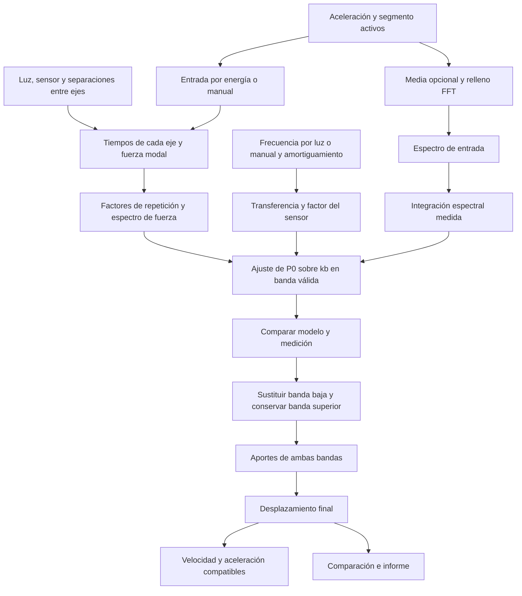

# Tokunaga: reconstrucción ferroviaria, formulación de 2022

`TK`, con identificador `tokunaga_bridge`, incorpora la formulación de Tokunaga,
Ikeda y Yoshida de **2022**. Reconstruye el desplazamiento de un vano
simplemente apoyado durante el paso de un tren a partir de aceleración vertical.
La posición del sensor se introduce dentro del vano y la salida corresponde a
ese punto. Es el décimo método de DESP Studio.

No requiere importar un modelo de elementos finitos: la aplicación construye
un modelo analítico de primer modo con los datos del puente y del tren. Ese
modelo es necesario para recuperar la componente lenta que una integración
directa de aceleración suele contaminar con deriva.

## Fuente implementada y versiones

| Fuente | Papel en DESP |
| --- | --- |
| [Tokunaga, Ikeda y Yoshida, 2022](https://doi.org/10.2208/jscejseee.78.1_47), pp. 48–54, ecuaciones 2–3, 6, 9–10, 15–19, 27–29 y 33 | Fuente principal de la formulación, de los límites de frecuencia y de la aproximación inicial de frecuencia por luz |
| [Tokunaga e Ikeda, 2023](https://doi.org/10.2219/rtriqr.64.2_115), pp. 115–116, ecuaciones 1–4 | Exposición complementaria en inglés; presenta el mismo esquema y un límite inferior de ajuste diferente |
| [Tokunaga, 2024](https://doi.org/10.1016/j.istruc.2024.106462) | Continuación que añade cancelación de ruido; no se afirma reproducir esa mejora |

La fórmula completa de 2022 y la exposición de 2023 se revisaron directamente.
Del artículo de 2024 se pudo consultar el resumen, pero no verificar el texto
completo. Por ello, TK conserva el año 2022 y no se presenta como implementación
del procedimiento de cancelación de ruido de 2024.

La fuente principal se incluye como
[`tokunaga_bridge_displacement_2022.pdf`](../../desp_desktop_app/references/tokunaga_bridge_displacement_2022.pdf),
una copia íntegra sin modificar del
[PDF de J-STAGE](https://www.jstage.jst.go.jp/article/jscejseee/78/1/78_47/_pdf).
Es una publicación de acceso libre, © 2022 Japan Society of Civil Engineers;
no se le atribuye licencia CC BY. La ficha abre la página 6 del PDF, numerada
52 en el artículo. Su huella SHA-256 y procedencia se conservan en el
[registro de referencias](../../desp_desktop_app/references/README.md).
La consulta del PDF de 2022 y el cálculo funcionan sin conexión; las fuentes
complementarias de 2023 y 2024 se abren mediante sus enlaces editoriales.

## Hipótesis y datos necesarios

- Un vano simplemente apoyado, con primer modo de flexión dominante y señal
  vertical medida bajo la vía, en una posición conocida entre los apoyos.
- Un tren con posiciones conocidas de los ejes y carga aproximadamente igual
  en todos ellos. La configuración inicial contiene seis ejes.
- Velocidad constante durante el paso y geometría conocida.
- Un registro que contenga el paso completo, con tiempo suficiente antes y
  después para inspeccionar ruido y respuesta residual.
- Muestreo uniforme y coherencia entre las unidades, el eje temporal y la
  frecuencia de muestreo.

| Dato | Parámetro | Significado |
| --- | --- | --- |
| `Lb` | `bridge_span_m` | Luz del vano, en metros |
| `x` | `sensor_position_m` | Posición del sensor desde el apoyo de entrada, en metros; `0 < x < Lb` |
| `v` o `V` | `train_speed_kmh` | Velocidad introducida en km/h, convertida mediante `v = V/3.6` |
| Separaciones | `axle_spacings_m` | Distancias entre ejes consecutivos; cinco distancias definen seis ejes |
| Geometría | `train_geometry_mode` | Separaciones entre ejes, inicialmente; vehículos regulares como alternativa |
| `t0` | `entry_mode` / `entry_time_s` | Entrada estimada por energía o tiempo manual, en el mismo eje temporal que `SignalRecord.time_s` |
| `fb` | `frequency_mode` / `natural_frequency_hz` | Frecuencia estimada con la luz o frecuencia manual, en Hz |
| `ζ` | `damping_ratio` | Amortiguamiento modal, como fracción adimensional |

**Para empezar hay que introducir luz, velocidad y posición del sensor.** Estos
tres datos parten de cero como indicación de que están pendientes. No se deducen
del TXT. La geometría inicial, compartida con BU, es:

```text
train_geometry_mode = axle_spacings
axle_spacings_m      = 17.4, 17.75, 17.75, 17.75, 17.4
posiciones de ejes  = 0, 17.4, 35.15, 52.9, 70.65, 88.05 m
distancia entre ejes extremos = 88.05 m
```

La lista usa metros, punto decimal y comas entre separaciones. Es editable y
representa los ejes del paso que se analiza; no fija el número de vagones ni
supone una composición repetida. La suma individual de cargas utiliza la
ecuación 3c de 2022.

La alternativa `regular_vehicles` conserva la composición del artículo:
`vehicle_count` vehículos, separados por `vehicle_length_m = Lv`, con cuatro
ejes por vehículo en `[0, a, b, a+b]`. En ese modo `axle_spacing_m = a` y
`bogie_spacing_m = b`; se exige `0 < a < b` y `a+b < Lv`. Sus campos sólo
definen la carga cuando se elige esa alternativa.

## Entrada y dinámica cuando todavía no se conocen

`entry_mode = automatic` propone inicialmente `t0` con la detección de energía
de DESP. La gráfica conserva la señal y marca la entrada utilizada. Es una ayuda
para localizar el evento: el comienzo detectable de vibración puede diferir de
la entrada física del primer eje. Conviene contrastarlo con la llegada del tren,
la geometría y las fases del ajuste. Si se conoce el instante, se elige
`entry_mode = manual` y se introduce `entry_time_s`.

El eje del segmento en la interfaz suele comenzar en cero. Si se utiliza la API
con un registro cuyo primer tiempo es distinto de cero, `t0` debe seguir ese
mismo origen; el cálculo convierte ambos a tiempos relativos antes de formar
las fases de la FFT.

`frequency_mode = span_estimate` utiliza inicialmente:

```text
fb = 50 Lb^(−0.8) Hz, con Lb en metros
```

La ecuación 33 de 2022, página 54, usa esta relación en sus casos numéricos como
aproximación de puentes relativamente flexibles; el caso supone un puente de
concreto de una vía. Es una orientación inicial, no una identificación modal
del registro ni una relación calibrada para cualquier puente. El valor efectivo
aparece en las gráficas y diagnósticos exportados, junto con el modo de entrada y
frecuencia utilizado. Las estimaciones generan avisos para que se revisen.

Para obtener una frecuencia propia más representativa:

1. Localizar la salida del último eje. Con los seis ejes iniciales,
   `t_salida = t0 + (88.05 + Lb)/v`, con `v` en m/s.
2. Seleccionar vibración libre posterior, con duración y señal suficientes para
   distinguir la oscilación del ruido; no usar como frecuencia propia cualquier
   pico producido por el espaciamiento del tren durante el paso.
3. Examinar su espectro y la estabilidad del pico en distintos recortes. El
   apéndice de 2022, página 59, emplea una búsqueda en
   `[30 Lb^(−0.8), 120 Lb^(−0.8)] Hz`; es una banda orientativa de ese estudio y
   puede no contener el modo relevante de otro puente.
4. Elegir `frequency_mode = manual` e introducir la frecuencia identificada en
   `natural_frequency_hz`. También puede usarse una identificación modal previa.

La etapa **Vibración posterior: diagnóstico de frecuencia** muestra la PSD
posterior a la salida geométrica cuando hay al menos 16 muestras. Utiliza una
ventana Hann y retira una tendencia lineal sólo para ese diagnóstico; no altera
la aceleración del cálculo. Marca `fb` utilizada e informa la resolución de la
cola. Un registro corto puede mostrar el gráfico sin resolver con suficiente
precisión el modo: esa vista ayuda a revisar, sin escoger automáticamente un pico.

Esta revisión es una tarea del analista: la opción por luz no ejecuta una
identificación modal automática. El amortiguamiento inicial `ζ = 0.02` equivale
al 2 % utilizado en los ejemplos de la fuente y sigue siendo una aproximación.
Puede sustituirse por un valor de vibración libre o de un estudio anterior.

No se piden por separado la masa modal, la rigidez ni la carga por eje: se estima
su combinación `y0 = P0/kb`, expresada en metros.

## Modelo y reconstrucción

Para un eje que entra al vano en `tj`, la fuerza modal adimensional relativa a
`P0` es una media onda sinusoidal durante `T = Lb/v`. La suma de todos los ejes
define `λ(t)`, sin dividirla por su máximo:

```text
pj         = posición del eje j desde el primer eje
tj         = t0 + pj/v
λ(t)       = suma_j sin[π(t−tj)/T], sólo donde 0 ≤ t−tj ≤ T
ωv         = π/T
Fλ(ω)      = G(ω) suma_j exp(−iωtj)
G(ω)       = ωv [1 + exp(−iωT)] / (ωv² − ω²)
ωb         = 2π fb
Sd(ω)      = 1 / [1 − (ω/ωb)² + 2iζ(ω/ωb)]
φ(x)       = sin(πx/Lb)
Dmodelo(ω) = s y0 φ(x) Fλ(ω) Sd(ω)
```

La forma modal `φ(x)` procede de la ecuación 2. Vale uno en el centro del vano
y reduce la respuesta de primer modo hacia los apoyos. El modelo y la
integración medida representan el punto del sensor; el resultado no se convierte
automáticamente a flecha central. La demostración experimental del artículo es
en centro de vano: usar otra posición incorpora esa dependencia espacial del
modelo de primer modo y exige comprobar su pertinencia en el puente analizado.
Como `y0` se ajusta con la propia aceleración, el factor constante `φ(x)` se
absorbe en esa escala. Cambiar la posición declarada para un mismo registro no
traslada la medición a otro punto del puente.

La suma finita de fases evita dividir las series geométricas por cero. El factor
`G` se evalúa mediante una expresión equivalente de su integral con `sinc`, que
conserva los límites en las singularidades removibles: `G(0)=2T/π` y
`G(ωv)=−iT/2`. Esta evaluación no altera el modelo de carga.

`s` es la dirección de la flecha en el eje elegido: `−1` por defecto y `+1` si
la convención del sensor es la contraria. Este control debe coincidir con la
polaridad de la aceleración. La estimación de escala usa magnitudes, por lo que
no identifica por sí sola ese signo.

Con `A(ω)` como transformada de la aceleración acondicionada según el control
de media, la integración medida para
`ω > 0` es `Dmedido(ω)=−A(ω)/ω²`. Al aplicar la ecuación 27 de 2022 a la posición
del sensor, la estimación se expresa como:

```text
y0 = promedio en la banda de ajuste de |Dmedido(ω) / [φ(x) Fλ(ω) Sd(ω)]|
```

Esta escala es **el desplazamiento estático unitario `P0/kb`**, no el máximo
estático del tren completo ni el máximo dinámico de la señal. En las ecuaciones
6 de 2022, el máximo estático del tren en centro de vano es `λmax y0`; en la
posición del sensor es `φ(x) λmax y0`. Como `Fλ` ya representa la suma de ejes
sin normalizar, no se multiplica otra vez por `λmax` al reconstruir.

La ecuación 28 combina el modelo y la medición con una frontera definida:

```text
Dfinal(ω) = Dmodelo(ω), si 0 ≤ ω < ωm
Dfinal(ω) = Dmedido(ω), si ω ≥ ωm
dfinal(t) = transformada inversa de Dfinal
```

La sustitución es directa, sin mezcla gradual entre bandas. La respuesta cerca
de la frecuencia natural queda en la zona medida cuando se usan los límites
publicados, evitando imponer el modelo lineal sobre toda la respuesta dinámica.
Los términos de frecuencia cero proceden del modelo; no se fuerza la media ni
el desplazamiento residual a cero.

La transformada teórica `Fλ` es continua. El cálculo conserva la escala temporal
con una convención coherente: `A = dt × rFFT(a)` y la transformada inversa del
desplazamiento se aplica a `Dfinal/dt`. Añadir ceros no modifica `dt`.

## Bandas y controles numéricos

El modo **Publicación** utiliza los valores de 2022:

```text
ωe1 = max(2, 0.1 ωb)       [rad/s]
ωe2 = 0.6 ωb              [rad/s]
ωm  = max(0.2, 0.6 ωb)    [rad/s]
```

En Hz equivalen a `fmin=max(1/π, 0.1 fb)`, `fmax=0.6 fb` y
`fm=max(0.1/π, 0.6 fb)`. Los valores `2` y `0.2` son límites en **radianes por
segundo**, no en Hz. Si la frecuencia natural es demasiado baja para que exista
una banda válida, hay que revisar la aplicabilidad y la configuración; no se
puede identificar una escala a partir de un intervalo vacío.

El selector `band_mode` parte de **Publicación** (`publication`). Su opción
**Manual** (`manual`) permite introducir límite inferior (`fit_min_hz`), superior
(`fit_max_hz`) y frontera de sustitución (`replacement_hz`) en Hz para estudiar
sensibilidad. Estos valores quedan registrados
en el resultado. La publicación de 2023 usa `max(1, 0.1ωb)` como límite inferior;
ese cambio no se aplica silenciosamente al preajuste de 2022.

DESP añade las siguientes decisiones explícitas:

| Control o protección | Comportamiento y motivo |
| --- | --- |
| Entrada automática | Propuesta auxiliar por energía, identificada como estimación; el tiempo manual permite sustituirla |
| Frecuencia por luz | Preajuste basado en la ecuación 33 de los casos numéricos de 2022; deja registrado el valor efectivo y puede sustituirse por una frecuencia identificada |
| Umbral espectral relativo, `spectral_floor_ratio` | Valor inicial 0.01; excluye del ajuste bins donde el módulo del modelo es demasiado pequeño respecto al máximo de la banda, evitando cocientes dominados por ceros o cancelaciones |
| Media de bins válidos | Aproxima el promedio de la ecuación 27 con pesos iguales sobre la malla uniforme que supera el criterio; la exclusión de bins es una salvaguarda adicional |
| Soporte de la banda | Exige al menos cinco bins válidos y que el ancho de banda multiplicado por la duración medida sea al menos tres; el relleno no permite eludir este último requisito |
| Retirada de media, `remove_acceleration_mean` | Activada inicialmente; resta la media global de aceleración antes de añadir ceros para reducir la fuga espectral de un sesgo constante; se puede desactivar |
| Relleno FFT con ceros, `padding_factor` | Factor inicial 2, configurable entre 1 y 8; añade ceros al final y alarga el periodo de la FFT para estudiar efectos de borde, sin añadir información física |
| Dirección de flecha, `deflection_direction` | Selección explícita negativa (`negative`, inicial) o positiva (`positive`); no se infiere del promedio de magnitudes |
| Diagnósticos de ajuste | Comparan modelo y medición y advierten de discrepancias y falta de coherencia |
| Revisión de la cola | Advierte cuando el registro posterior al paso no permite observar adecuadamente la respuesta residual |

El relleno con ceros también cambia la malla sobre la que se aproxima el ajuste,
por lo que su efecto debe revisarse en un estudio de sensibilidad. El resultado
exportado conserva el tiempo y el número de muestras del segmento original.
Incluso con umbral relativo cero se excluyen valores menores o iguales a
`10⁻¹²` del máximo del modelo en la banda, como protección frente a sus ceros.
La FFT admite hasta cuatro millones de muestras después del relleno.
La señal original se conserva en su etapa; quitar su media es una operación
opcional de acondicionamiento de DESP y no una instrucción añadida a las
ecuaciones del autor. No se resta la media del desplazamiento ni se fuerza su
residual final.

La inversión FFT representa una señal periódica durante el intervalo ampliado.
La respuesta teórica posterior al paso puede alcanzar la siguiente copia si el
decaimiento es lento; el aviso correspondiente no elimina esa contribución.
Para obtener series reales, los coeficientes DC y Nyquist siguen las
restricciones de la FFT real. La velocidad se obtiene con `iωD` y la aceleración
con `−ω²D`; el coeficiente de Nyquist de la velocidad se anula cuando existe.

El umbral espectral no es la cancelación de ruido añadida en 2024. No se atribuye
al autor la exclusión concreta de bins, su valor inicial ni el factor de relleno.

## Gráficas y artefactos intermedios



La fuente independiente del diagrama está en `tokunaga_bridge.mmd`.

| Vista | Qué permite revisar |
| --- | --- |
| Aceleración de entrada | Sesgo, duración y señal realmente utilizada |
| Entrada estimada o manual | Instante efectivo marcado sobre la señal y coherencia con el paso completo |
| PSD posterior a la salida | Comparación de `fb` utilizada con la vibración residual, su resolución y posibles picos; disponible con al menos 16 muestras posteriores |
| Acondicionamiento | Media retirada, si se activó, y aceleración preparada para la FFT |
| Geometría y tiempos de ejes | Correspondencia de luz, sensor, seis ejes iniciales o composición alternativa, velocidad y entrada con el evento |
| Posición del sensor y forma modal | Factor `sin(πx/Lb)` y ubicación real dentro del vano |
| Fuerza modal temporal | Superposición de la acción de todos los ejes sobre el primer modo |
| Espectro de entrada | Banda disponible, componente lenta y frecuencias dominantes |
| Factores de repetición | Refuerzos y cancelaciones debidos a la geometría del tren |
| Espectro de fuerza modal | Frecuencias en las que el modelo puede o no sostener el ajuste |
| Módulo de `Sd` y fases del modelo | Frecuencia efectiva, origen de su valor y efecto del amortiguamiento; fases de `Sd`, `Fλ` y su producto |
| Integración medida en frecuencia | Amplificación de la componente lenta antes de corregirla |
| Banda y escala estimada | Cocientes admitidos, bins excluidos y valor constante de `P0/kb` |
| Modelo frente a medición | Comparación de magnitudes y de fases en los bins válidos; coherencia del signo y los tiempos |
| Máscaras de reconstrucción | Frontera exacta entre banda sustituida y medida |
| Espectro híbrido | Suma de las dos bandas, incluida la componente DC teórica |
| Aportes temporales de las dos bandas | Qué parte de la historia final viene del modelo y cuál de la aceleración |
| Aceleración corregida y velocidad | Series compatibles con el desplazamiento reconstruido |
| Desplazamiento final | Resultado que se exporta y compara con los demás métodos |

Las vistas usan los mismos colores, ejes, controles de zoom y paneo, navegación
de etapas y exportación de figuras que el resto de la aplicación. Los informes
conservan las etapas cuando se activa su inclusión. Los parámetros y
diagnósticos acompañan al resultado, y una ejecución interrumpida conserva las
etapas completadas como parcial.

## Uso en puentes en operación y validación

La fuente de 2022 aplica el método a registros de pasos reales de Shinkansen por
vanos RC simplemente apoyados de 8.7 m; la exposición de 2023 muestra su uso con
unos 13 000 pasos registrados. Es evidencia de aplicación en servicio para ese
tipo de estructura y carga, no una validación general de cualquier viaducto.

Las pruebas numéricas de 2022 muestran mayor error cuando disminuye la velocidad
o aumenta el ruido. Su resultado de error cercano al 5 % está condicionado, entre
otros factores, por velocidad de al menos 150 km/h y ruido de desviación estándar
no mayor que 0.005 m/s²; no es una precisión garantizada para un TXT nuevo. Una
velocidad menor exige revisar especialmente la relación señal/ruido y el ajuste.

Los vanos continuos, varios trenes simultáneos, tráfico carretero mixto o cargas
muy desiguales por eje no quedan descritos por este modelo. Aplicarlo en esos
casos exigiría una formulación de carga y respuesta adecuada y nueva validación.
Tampoco debe interpretarse el modelo de primer modo como una reconstrucción de
la geometría deformada completa.

La validación metrológica independiente de TK en DESP queda pendiente: requiere
aceleración y desplazamiento medidos de forma sincronizada, geometría real,
velocidad, ejes y segmento verificables. La recuperación de casos analíticos y
las pruebas de contrato comprueban la implementación, no sustituyen ese contraste.

## Referencias

- Munemasa Tokunaga, Manabu Ikeda y Koji Yoshida. *Displacement response waveform
  restoration of simply support bridge during train passage based on
  measurement acceleration integration*. Journal of Japan Society of Civil
  Engineers, Ser. A1 (Structural Engineering & Earthquake Engineering),
  78(1), 47–60, 2022.
  [DOI: 10.2208/jscejseee.78.1_47](https://doi.org/10.2208/jscejseee.78.1_47);
  [PDF local](../../desp_desktop_app/references/tokunaga_bridge_displacement_2022.pdf).
- M. Tokunaga y M. Ikeda. *Structural Performance Evaluation of Existing
  Bridges Based on Acceleration Monitoring*. Quarterly Report of RTRI, 64(2),
  115–120, 2023. <https://doi.org/10.2219/rtriqr.64.2_115>
- M. Tokunaga. *Displacement response waveform restoration of simply supported
  bridge during train passage using measured acceleration integration based on
  linear vibration theory*. Structures, 64, 106462, 2024.
  <https://doi.org/10.1016/j.istruc.2024.106462>
